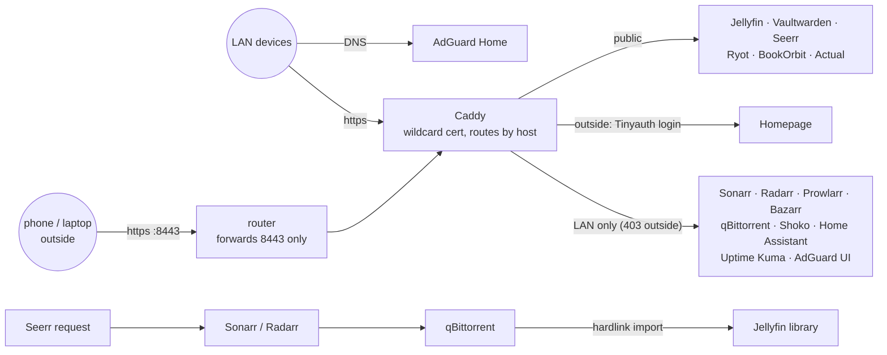

# homelab

A single-machine home lab: about 20 self-hosted services running as Docker containers on my everyday
desktop. No Kubernetes, no Compose: every service is one `up.sh` script you can read in a minute.

- **Media**: Jellyfin with an automated request → download → library pipeline, anime-aware.
- **Personal**: password manager, budget, media tracker, ebook library.
- **Home**: Home Assistant, ad-blocking DNS.
- **Ops**: HTTPS reverse proxy, uptime monitoring, nightly backups, update and disk alerts, monthly access
  audit, all reporting to one Telegram bot.

## How it fits together



- **One entry point.** The ISP blocks inbound 80/443, so the router forwards external **8443** to Caddy and
  nothing else. Certificates come from Let's Encrypt via the DuckDNS DNS-01 challenge (no inbound port
  needed). DuckDNS holds only one TXT record, so it's a single wildcard cert, and Caddy routes by hostname.
- **Same URL at home and outside.** AdGuard answers `*.daoseeking.duckdns.org` with the LAN IP. The router has
  no NAT loopback, so without this the public names wouldn't work from inside.
- **Three exposure levels**, all set in [`caddy/Caddyfile`](caddy/Caddyfile): public apps (each with its own
  login, sign-ups off), the dashboard behind Tinyauth, and admin tools that answer 403 to anything outside the LAN.
- **Same paths in every container.** Media is mounted at the identical host path in Jellyfin, Shoko, Sonarr,
  Radarr and qBittorrent. No path mappings, and imports are hardlinks (instant, no extra space) because
  downloads and the library share one filesystem.

## Services

| Folder | Service | Reachable |
|---|---|---|
| [`jellyfin`](jellyfin/up.sh) | **Jellyfin** media server, with plugins for Shoko anime metadata, intro skipping and Seerr/Sonarr integration | public |
| [`arr`](arr/up.sh) | **Seerr** requests, **Sonarr/Radarr** TV and movies, **Prowlarr** indexers (+ FlareSolverr), **Bazarr** subtitles (en + ru), **qBittorrent** | Seerr public, rest LAN |
| [`shoko`](shoko/up.sh) | **Shoko Server**: identifies anime files by hash against AniDB, feeds Jellyfin through Shokofin | LAN |
| [`ryot`](ryot/up.sh) | **Ryot** media tracker, fed by Jellyfin webhooks | public |
| [`bookorbit`](bookorbit/up.sh) | **BookOrbit** ebook / manga library (+ pgvector Postgres) | public |
| [`vaultwarden`](vaultwarden/up.sh) | **Vaultwarden** (Bitwarden-compatible password manager) | public |
| [`actual`](actual/up.sh) | **Actual Budget** | public |
| [`homeassistant`](homeassistant/up.sh) | **Home Assistant**, plus [`dashboard.py`](homeassistant/dashboard.py) that generates its dashboard | LAN |
| [`adguard`](adguard/up.sh) | **AdGuard Home**: LAN DNS + ad blocking, local answers for the homelab names | LAN |
| [`caddy`](caddy/Caddyfile) | **Caddy** reverse proxy, custom build with the DuckDNS DNS module | — |
| [`duckdns`](duckdns/up.sh) | keeps the DuckDNS name pointed at the home IP | — |
| [`tinyauth`](tinyauth/up.sh) | **Tinyauth** login in front of the dashboard (basic auth doesn't work in iOS home-screen apps) | public login page |
| [`homepage`](homepage/config/services.yaml) | **Homepage** dashboard with live widgets for every service | Tinyauth |
| [`uptime-kuma`](uptime-kuma/up.sh) | **Uptime Kuma**: probes every service each minute, alerts to Telegram | LAN |
| [`diun`](diun/up.sh) | **Diun**: weekly "new image available" notices (updating stays manual) | — |
| [`watchdog`](watchdog) | heartbeat to healthchecks.io, disk-space alerts, failure alerts, [monthly access audit](watchdog/audit.sh) | — |
| [`backup`](backup/backup.sh) | nightly backup of every app's database and config | — |
| [`net`](net/cake-shaper.service) | CAKE upload shaping, keeps calls and games smooth while torrents seed | — |
| [`widget`](widget) | KDE Plasma widgets showing live service status on the desktop | — |
| [`dns`](dns) | old dnsmasq resolver, replaced by AdGuard, kept for rollback | — |

## Running it

```sh
./<service>/up.sh        # pull, recreate, start; re-run to update
```

Each script is plain `docker run`: ports bound to `127.0.0.1` (Caddy is the only thing listening outside),
`--restart unless-stopped`, data in a gitignored folder next to the script or in a named volume.

**Secrets** never enter git. Each service reads `<service>/.env` (gitignored), and `.env.example` lists the
keys it needs. The history is checked with [gitleaks](https://github.com/gitleaks/gitleaks) before pushing.

**Adding a service:** copy the closest `up.sh`, bind its port to `127.0.0.1`, add a host block to the
Caddyfile (with `respond @outside "LAN only" 403` unless the app has its own login), then add a Homepage entry,
an Uptime Kuma monitor and a line in `backup/backup.sh`.

## Keeping it alive

| Question | Answered by |
|---|---|
| Is a service down? | Uptime Kuma, 60 s probes → Telegram |
| Is the whole PC or the internet down? | a systemd timer pings healthchecks.io every 5 min; silence → email + Telegram |
| Is a disk filling up? | `watchdog/disk-check.sh` → Telegram at 99 % |
| Are there new versions? | Diun, weekly → Telegram; then re-run that `up.sh` |
| Can I restore? | `backup/backup.sh` nightly at 04:00: SQLite via the online backup API, `pg_dump` for Postgres, configs, `.env` files and a git bundle, kept 14 days on a second drive; a failed run alerts to Telegram |
| Did anyone get in? | `watchdog/audit.sh` on the 1st of every month: outside visitors per service, top IPs, login and sign-up attempts, 401/403s, and every app's user list compared with last month → Telegram |

## Hardware

One desktop that's also my daily machine: Ryzen 9 5950X, 32 GB RAM, RTX 4080, CachyOS (Arch), two NVMe
drives and a SATA SSD. Containers are kept from hurting the desktop: `--cpus` limits for Jellyfin, CAKE for
upload bandwidth.
