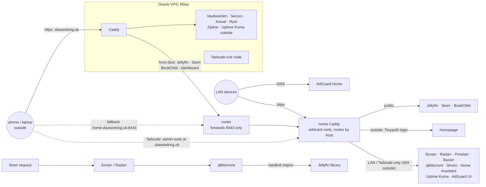

# homelab

A home lab on my everyday desktop plus one free Oracle Cloud VPS: about 20 self-hosted services as Docker
containers. Media and anything that needs the disks or the LAN stays home; small always-on apps and the public
front door live on the VPS. No Kubernetes: every service is one `up.sh` you can read in a minute, plain
`docker run` for single containers and a `compose.yaml` for the multi-container stacks.

- **Media**: Jellyfin with an automated request → download → library pipeline, anime-aware.
- **Personal**: password manager, finances, media tracker, ebook library, file sharing / pastes.
- **Home**: Home Assistant, ad-blocking DNS.
- **Ops**: HTTPS reverse proxies, uptime monitoring from inside and outside, nightly local + off-site
  backups, update and disk alerts, monthly access audit, all reporting to one Telegram bot; Tailscale VPN.

## How it fits together



- **Three kinds of names** on `daoseeking.uk` (Cloudflare DNS):
  - `<app>.daoseeking.uk` → the VPS. It serves its own apps and forwards the public home apps home, so
    everyday URLs need no port. On the LAN, AdGuard answers the home apps' names with the desktop, so streams
    never leave the house.
  - `<app>.home.daoseeking.uk:8443` → straight home (DDNS-updated). The ISP blocks inbound 80/443, so the router
    forwards **8443** to home Caddy and nothing else. Works even when the VPS is down.
  - Admin tools (Sonarr, Radarr, Prowlarr, Bazarr, qBittorrent, Shoko, AdGuard) also use plain `<app>.daoseeking.uk`,
    but those records point at the desktop's Tailscale IP instead of the VPS, and AdGuard answers them with the
    desktop on the LAN: one link works at home and over Tailscale. `<app>.ts.daoseeking.uk` (Tailscale IP) stays
    for Uptime Kuma.
- **Certificates:** home Caddy gets wildcards via Cloudflare DNS-01 (no inbound port needed); the VPS Caddy gets
  one per host over port 80.
- **Three exposure levels**, all set in [`caddy/Caddyfile`](caddy/Caddyfile): public apps (each with its own
  login, sign-ups off), the dashboard behind Tinyauth, and admin tools that answer 403 to anything outside the
  LAN or tailnet. Home Caddy trusts `X-Forwarded-For` only from the VPS, so the rules and the audit see real
  visitor IPs.
- **Old `*.daoseeking.duckdns.org:8443` names** still work while devices move over; the moved apps' old names
  are forwarded to the VPS.
- **Same paths in every container.** Media is mounted at the identical host path in Jellyfin, Shoko, Sonarr,
  Radarr and qBittorrent. No path mappings, and imports are hardlinks (instant, no extra space) because
  downloads and the library share one filesystem.

## Services

| Folder | Service | Reachable |
|---|---|---|
| **On the VPS** | | |
| [`vps`](vps) | VPS base setup (firewall, Docker + Compose, auto security updates, Tailscale exit node) and its **Caddy** | — |
| [`zipline`](zipline/compose.yaml) | **Zipline**: file sharing, text pastes and short links with expiring URLs (+ Postgres); own login, no sign-ups | public |
| [`securo`](securo/compose.yaml) | **Securo**: personal finance in native currencies, fed from TBC/BoG statements by `~/work/ynab-bog-tbc` (`ynab-import securo`); live FX via Open Exchange Rates (+ Postgres, Redis, Celery); own login, no sign-ups | public |
| [`uptime-kuma`](uptime-kuma/up.sh) | **Uptime Kuma**: every public URL from outside (both paths), the VPS apps, and the LAN-only home tools over Tailscale, 60 s probes → Telegram | own login |
| **At home** | | |
| [`jellyfin`](jellyfin/up.sh) | **Jellyfin** media server, with plugins for Shoko anime metadata, intro skipping and Seerr/Sonarr integration | public |
| [`arr`](arr/compose.yaml) | **Seerr** requests, **Sonarr/Radarr** TV and movies, **Prowlarr** indexers (+ FlareSolverr), **Bazarr** subtitles (en + ru), **qBittorrent** | Seerr public, rest LAN |
| [`shoko`](shoko/up.sh) | **Shoko Server**: identifies anime files by hash against AniDB, feeds Jellyfin through Shokofin | LAN |
| [`bookorbit`](bookorbit/compose.yaml) | **BookOrbit** ebook / manga library (+ pgvector Postgres) | public |
| [`homeassistant`](homeassistant/up.sh) | **Home Assistant**, plus [`dashboard.py`](homeassistant/dashboard.py) that generates its dashboard | LAN |
| [`adguard`](adguard/up.sh) | **AdGuard Home**: LAN DNS + ad blocking, local answers for the homelab names | LAN |
| [`caddy`](caddy/Caddyfile) | **Caddy** reverse proxy, custom build with the Cloudflare (+ DuckDNS) DNS modules | — |
| [`ddns`](ddns/up.sh) | keeps `*.home.daoseeking.uk` pointed at the home IP | — |
| [`duckdns`](duckdns/up.sh) | keeps the old DuckDNS name pointed home, until it's retired | — |
| [`tinyauth`](tinyauth/up.sh) | **Tinyauth** login in front of the dashboard (basic auth doesn't work in iOS home-screen apps) | public login page |
| [`homepage`](homepage/config/services.yaml) | **Homepage** dashboard with live widgets for every service | Tinyauth |
| [`diun`](diun/up.sh) | **Diun**: weekly "new image available" notices (updating stays manual) | — |
| [`watchdog`](watchdog) | heartbeat to healthchecks.io, disk-space alerts, failure alerts, [monthly access audit](watchdog/audit.sh) | — |
| [`backup`](backup/backup.sh) | nightly backup of every app's database and config | — |
| [`net`](net/cake-shaper.service) | CAKE upload shaping, keeps calls and games smooth while torrents seed | — |
| [`widget`](widget) | KDE Plasma widgets showing live service status on the desktop | — |
| [`dns`](dns) | old dnsmasq resolver, replaced by AdGuard, kept for rollback | — |

## Running it

```sh
./<service>/up.sh        # pull, recreate, start; re-run to update
```

Single-container services are plain `docker run`; the stacks with a database or several apps (`arr`,
`bookorbit`, `zipline`, `ryot`, `securo`) are a `compose.yaml`, and their `up.sh` is `docker compose up -d --pull always`,
which restarts only what changed. Either way: ports bound to `127.0.0.1` (Caddy is the only thing listening
outside), `--restart unless-stopped`, data in a gitignored folder next to the script or in a named volume. VPS
folders are rsynced to `vps:~/homelab` and run there (`ssh vps ~/homelab/<service>/up.sh`); base setup is
`ssh vps 'sudo bash -s' < vps/setup.sh`.

**Secrets** never enter git. Each service reads `<service>/.env` (gitignored), and `.env.example` lists the
keys it needs. The history is checked with [gitleaks](https://github.com/gitleaks/gitleaks) before pushing.

**Adding a service:** copy the closest `up.sh` (or `compose.yaml`), bind its port to `127.0.0.1`, add a host
block to the Caddyfile (with `respond @outside "LAN only" 403` unless the app has its own login), then add a Homepage entry,
an Uptime Kuma monitor and a line in `backup/backup.sh`.

## Keeping it alive

| Question | Answered by |
|---|---|
| Is a service down? | Uptime Kuma on the VPS: public URLs from outside, home tools over Tailscale (red while the desktop is on the work tailnet), 60 s probes → Telegram |
| Is the whole PC, the VPS or the internet down? | the PC (systemd timer) and the VPS (cron) each ping their own healthchecks.io check every 5 min; silence → email + Telegram |
| Is a disk filling up? | `watchdog/disk-check.sh` → Telegram at 99 % |
| Are there new versions? | Diun, weekly → Telegram; then re-run that `up.sh` |
| Can I restore? | `backup/backup.sh` nightly at 04:00: SQLite via the online backup API, `pg_dump` for Postgres, configs, `.env` files and a git bundle, the VPS apps pulled over ssh; kept 14 days on a second drive **and** as encrypted restic snapshots on the VPS (14 daily, 8 weekly, 6 monthly; password in 1Password); a failed run alerts to Telegram |
| Did anyone get in? | `watchdog/audit.sh` on the 1st of every month: outside visitors per service, top IPs, login and sign-up attempts, 401/403s, and every app's user list compared with last month → Telegram |

## Hardware

One desktop that's also my daily machine: Ryzen 9 5950X, 32 GB RAM, RTX 4080, CachyOS (Arch), two NVMe
drives and a SATA SSD. Containers are kept from hurting the desktop: `--cpus` limits for Jellyfin, CAKE for
upload bandwidth, and the small always-on apps moved to the VPS.

Plus an Oracle Cloud Always Free VM in Milan: 4 Ampere ARM cores, 24 GB RAM, 150 GB disk, Ubuntu 26.04.
